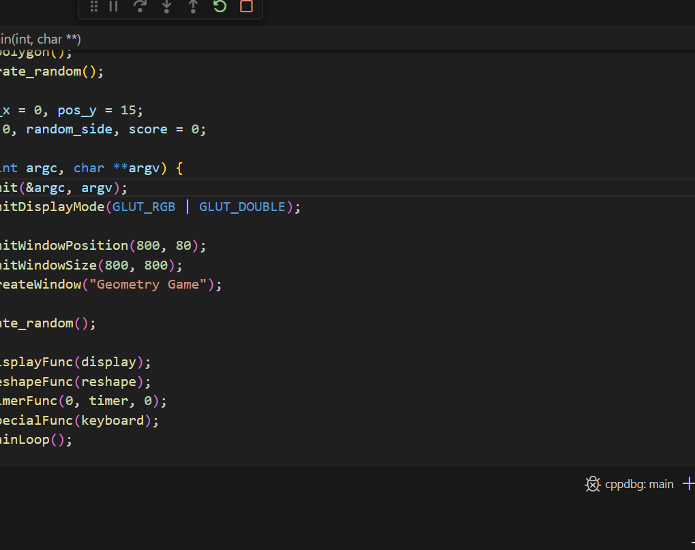

# Simple Game Project with GLUT(OpenGL) Library  

The game projects also uses SDL2 library showing scorebox at the end. We mainly shape polygon and controlling key over timeframe in the raw code. It was a **fun project** overall.  

### Game Demo 

